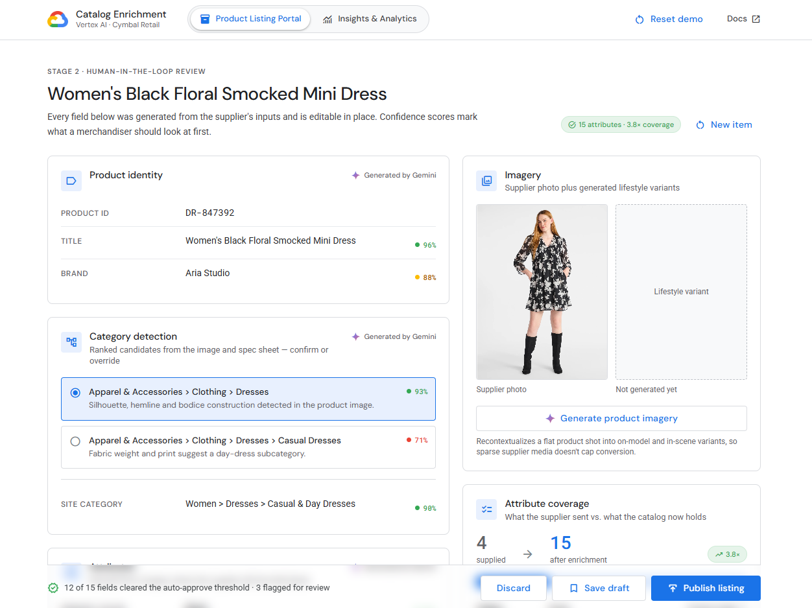

# Catalog Enrichment & Insights Demo

A vendor-neutral demo of AI-powered catalog enrichment on Google Cloud. Sparse
supplier data goes in; a complete, structured, merchandisable product record
comes out — with a human in the loop wherever the model isn't confident.

| Page | What it shows |
| --- | --- |
| **Product Listing Portal**| Upload a spec sheet, images or a product video → watch the multimodal enrichment pipeline run → review and edit every generated field: category detection, derived attributes, descriptions, SEO tags, Q&A, localization, generated imagery, and the raw payload. Below the record: visually similar items, assortment-overlap warnings, and category trends. |
| **Insights & Analytics** | The catalog-level view. A Gemini assistant grounded in the enriched catalog, plus coverage KPIs, coverage-by-category, confidence distribution, most-engaged items, near-duplicate clusters, style/seasonal/social/video trends, and competitive intelligence. |

All data is synethic for demo purposes.


Sample:



## Run it

```bash
python server.py
```

That installs front-end dependencies on first run, starts the FastAPI backend on
`:8000` and Vite on `:5173`, then prints the URLs that work from outside the VM.

```
python server.py --backend-port 8001 --frontend-port 5174   # different ports
python server.py --skip-install                             # skip npm install
python server.py --proxy-base                               # see below
```

### Viewing it from a GEAP Workbench VM

The launcher prints a Workbench proxy URL of the form
`https://<proxy-host>/proxy/5173/`. If assets 404 there, relaunch with
`--proxy-base` — that sets Vite's `base` to `/proxy/5173/` so absolute asset
paths resolve. (With `--proxy-base` on, plain `http://localhost:5173` no longer
works; it's one or the other.)

Backend requirements, if you'd rather install them explicitly:

```bash
pip install --user -r backend/requirements.txt
```

## Layout

```
server.py                    launcher: uvicorn :8000 + vite :5173, prints URLs
backend/
  main.py                    FastAPI mock API (enrich, sample assets, insights)
  requirements.txt
frontend/
  src/
    App.jsx                  two-page shell
    components/
      TopBar.jsx             Google Cloud top bar + segmented nav
      ui.jsx                 Card, Pill, ConfidenceBadge, ScoreBar, …
    pages/
      ProductListingPortal.jsx
      InsightsAnalytics.jsx
    data/mock.js             every piece of demo data, in one file
    styles/
      tokens.css             Google Cloud design tokens (single source of truth)
      index.css              Tailwind layers + component classes
  tailwind.config.js         Tailwind theme mapped onto the tokens
assets/
  sample_product/            sample PDF + product images served by the API
  imgs/                      screenshots used in this README
```
